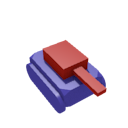

# SimpleRacingGame
A programming exercise that became a racing game engine written in Processing

Play as a rediculously fast tank  in a vast empty universe that only contains you and a track. 

## How does it work?
The tank always knows which face it rests on (or will rest on when it falls). 
This is implemented by loading the environment from a wavefront (.obj) file 
and converting the list of triangles into a doubly connected graph, which is 
used as a large state machine. The tank starts in the center of the face of 
the first index, and it's assigned to that face. 

The tank knows if it crossed a border witih the following steps:
1. Flatten the world into two dimensions by ignoring the y (up/down) axis.
2. Take the area of the triangle below the tank.
3. Take the sum of the areas of all three triangles formed by the player's position
and any two points.
4. If the area from (3) is significantly (>1.001x) greater than the the area from (2), 
the tank is outside the plane.
5. If (4) is true, repeat (2) and (3) on all adjacent faces to minimize 
the difference between the two values. The faces with the lowest 
difference is closest to being directly beneath the player. 
6. If the current "below" face is the closest one, the player has fallen from the map.
7. Otherwise, now pretend the closest face is "below" the tank, and 
start over at (2) until (5) is false.

Now the face below the tank is guaranteed to be beneath the tank.

## Controls
Standard WASD controls are implemented with some bonus controls:
* Q: let the computer play for you
* 1: Highlight the face you are on
* 2: Show the target that the computer would follow if it were playing
* 0: hide all debug data shown with 1 and 2
* left mouse click: jump. Hold for longer jumps

Also, try editing "data/Assets.txt" for more 
